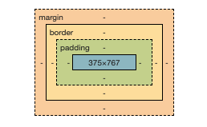

# 📦 CSS box model

<figure><figcaption><p>the box model</p></figcaption></figure>

Each element has the following basic properties, all of which have a numerical value (usually in pixels or percentage of its parent container):&#x20;

* **width** (left to right length)
* **height** (top to bottom length)
* **padding** (inner white space)
* **margin** (outer white space)
* **border** (boundary space that separates the inner white space and outer white space)

In addition, there exists:

* **overflow** (determines whether content inside a limited container spills over its border or not), most commonly taking on the values:
  * _**scroll**_ (the browser will give the container a scroll bar)
    * _**auto**_ (if the content exceeds the size of the container)
  * _**hidden**_ (the content will "disappear" after the end of the container)
  * _**visible**_ (the content will "spill over" after the end of the container)
* **overflow-x** (restricts the overflow value to the horizontal dimension)
* **overflow-y** (restricts the overflow value to the vertical dimension)

### Width and height

Self-explanatory, the `width` determines the left-right length of an element, e.g.:

```css
div.example {
    width: 250px;
}
```

Also, the height determine the top-bottom length of an element, e.g.:

```css
div.example {
    height: 100%;
}
```

In addition to pixels and percentages, we could also use different units!

#### Min and max

If we had specified the height and width, the `min-height`, `min-width`, `max-height` and `max-width` properties can override any height and width already placed on the selector:&#x20;

<pre class="language-css"><code class="lang-css"><strong>div.example {
</strong><strong>    height: 140px;
</strong><strong>    width: 90px;
</strong><strong>}
</strong><strong>
</strong><strong>div.example {
</strong>    min-height: 50px;
    max-height: 100px; /* this will shrink the div from 140px to 100px tall */
    min-width: 100px; /* this will expand the div from 90px to 100px */
    max-width: 100%; /* unless of course the div is 90-100px, then it will be 100%! */
}
</code></pre>

### Padding

Padding refers to the _inner_ whitespace of a container; it literally _pads_ the content from the container's edges!

```css
div.example {
    padding-top: 10px;
    padding-right: 20px;
    padding-bottom: 30px;
    padding-left: 40px;
}

div.example {
    padding: 10px 20px 30px 40px;
}
```

In the above example, the two declaration blocks have identical properties and values; the latter functions as a shorthand version of the former ... it moves clockwise from the top!

Also, the following long-form and short-hand remain popular among developers, as top and bottom (and left and right) often have the same values:

```css
div.example {
    padding-top: 20px;
    padding-right: 10px;
    padding-bottom: 20px;
    padding-left: 10px;
}

div.example {
    padding: 20px 10px;
}
```

### Margin

Margin refers to the outer whitespace of a container; the container's size does include this region that separates the container from other elements!&#x20;

```css
div.example {
    margin-top: 10px;
    margin-right: 20px;
    margin-bottom: 10px;
    margin-left: 20px;
}

div.example {
    margin: 10px 20px;
}
```

We notice in the above that the notation of margins imitate those of the paddings; also:

```css
div.topcontainer {
    margin-bottom: 50px;
}

div.bottomcontainer {
    margin-top: 25px;
}
```

for an HTML:

```markup
<div class="topcontainer">...</div>
<div class="bottomcontainer">...</div>
```

When two margins meet, the smaller margin combines with the larger margin; in the example above, a _50px space_ will appear between the two `<div>` elements, _instead of 75px_!

#### "Auto"

Using `auto` for a margin in the left-right value centers it horizontally:

```css
div.centered {
    margin: 0 auto; 
}
```

### Border

The border refers to the space between the margin and the padding:

```css
div.example {
    border-width: 10px;  
    border-style: solid; 
    border-color: red;  
}

div.example {
    border: 10px solid red; /* width style color */
}
```

As with paddings and margins, the border property has a shorthand but its own notation!

#### Border width

This "border thickness" property usually has an amount in pixels (`px`) but can use essentially any other units of distance!

#### Border style

The border style refers to the border's appearance and takes one value out of a closed set

```css
border-style: none;
border-style: hidden;
border-style: dotted;
border-style: dashed;
border-style: solid;
border-style: double;
border-style: groove;
border-style: ridge;
border-style: inset;
border-style: outset;

/* CLOCKWISE SHORTHANDS */

/* all four sides are solid */
border-style: solid;

/* top and bottom are dotted | left and right are solid */
border-style: dotted solid;

/* top is hidden | left and right are double | bottom is dashed */
border-style: hidden double dashed;

/* top is none | right is solid | bottom is dotted | left is dashed */
border-style: none solid dotted dashed;
```

#### Border color

Self-explanatory and can take on any of the [CSS color notations](css-colors.md)

```css
div.example {
    border-color: red;
    border-color: #990000;
    border-color: rgb(255, 0, 0);
    border-color: hsl(0, 50%, 50%);
}
```

#### Border radius

Furthermore, the border can have rounded edges with the `border-radius` property:

```css
div.example {
    border-radius: 5px;
}
```

A border can become a circle with a `border-radius` value of `50%`:

```css
div.example { 
    border-radius: 50%;
}
```

We can even choose which corner to set our border "radii":

```css
div.example {
    border-top-left-radius: 10%;
    border-top-right-radius: 20%;
    border-bottom-right-radius: 30%;
    border-bottom-left-radius: 40%;
}

div.example {
    border-radius: 10% 20% 30% 40%;
}
```

(Of course, the latter serves as the "clockwise shorthand" for the former in the above example!)

### Overflow

The overflow refers to how much content the container will display:

```css
div.example {
    /* browser will show a scrollbar on the div */
    overflow: scroll; 
}

div.example {
    /* browser will show a scrollbar only when necessary */
    overflow: auto; 
}

div.example {
    /* content will 'disappear' after the end of the container */
    overflow: hidden; 
}

div.example {
    /* content will 'spill over' after the end of the container */
    overflow: visible;
}
```

There also exist `overflow-x` and `overflow-y` to limit the overflow value in, respectively, the horizontal and vertical directions!
