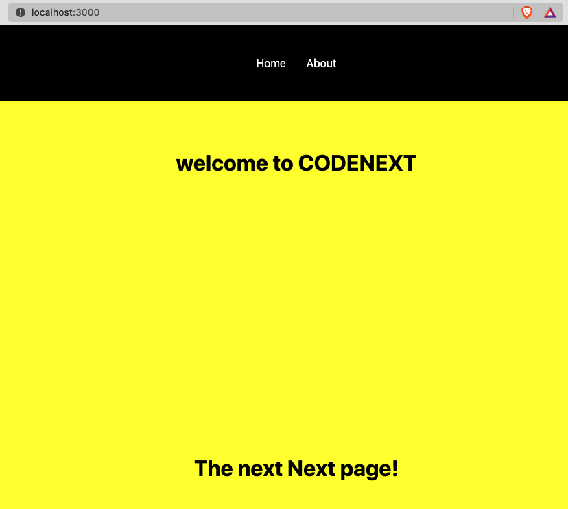

# Next.js navigations

Now that we have the power to create layouts, we can create a navigation as we did in React:

* importing a linking library
* creating a `Navigation` component
  * using a special JSX tag (instead of the HTML `<a>`) to create the link

We would also:

* create a new CSS file in `/styles/` called `Navigation.module.css` per the file naming convention
* import the CSS file in `/components/Navigation.js`

### Creating the navigation

Let's go into our `/components/` folder and create a new file called `Navigation.js`


```jsx
// importing the link
import Link from 'next/link'
import navStyles from '../styles/Navigation.module.css'

const Navigation = () => {
  return (
    <nav className={navStyles.nav}>
      <ul>
        <li>
          {/* here's our link */}
          <Link href='/'>Home</Link>
        </li>
        <li>
          {/* here's another link */}
          <Link href='/about'>About</Link>
        </li>
      </ul>
    </nav>
  )
}

export default Navigation
```


Now we have to create the `Navigation.module.css` file...

### Styling the navigation

Let's just use this CSS to make a fixed top navigation bar:


```css
.nav {
  position: fixed;
  width: 100%;
  display: flex;
  align-items: center;
  justify-content: center;
  background: #000;
  color: #fff;
  padding: 30px;
}

.nav ul {
  display: flex;
  justify-content: center;
  align-items: center;
  list-style: none;
  padding-left: 0;
}

.nav ul li a {
  margin: 15px;  
}
```


### Using the navigation

Now, we can see the fruits of our labour by updating the layout file we made in the last tutorial:


```jsx
// our new navigation
import Navigation from './Navigation'

import styles from '../styles/Layout.module.css'

const Layout = ({children}) => {
  return (
    {/* remember to have only a single parent div */}
    <>
      {/* place it atop the container */}
      <Navigation />
      <div className={styles.container}>
        <main className={styles.main}>
          <h1>welcome to CODENEXT</h1>
          {children}
        </main>
        <footer className={styles.footer}>
          &copy; current year
        </footer>
      </div>

    </>
  )
}

export default Layout
```


The result: a working fixed header navigation on all pages that use the Layout!


