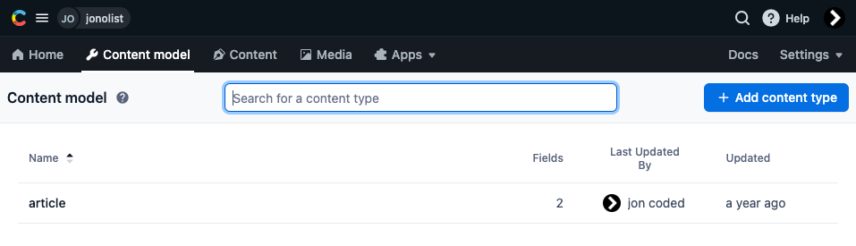
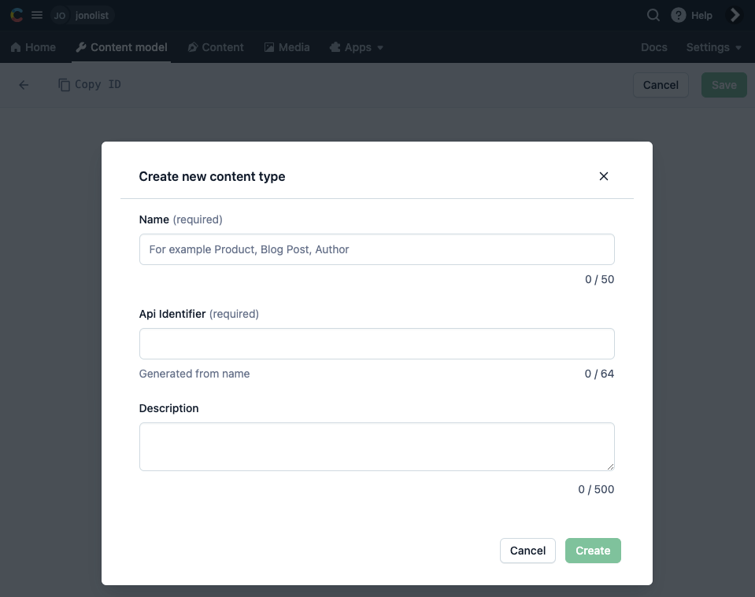
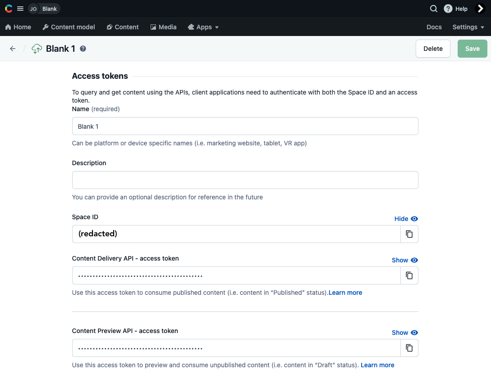

# Contentful app startup

### Installing our packages

From the very beginning on the command line, let us create a project folder, say `jonolist`:

`% mkdir jonolist`

Then, inside the folder, we initialize the project:

`% npm init`

We hit return (or Enter) to accept the defaults and then install the following npm packages: **contentful**, **react**, **react-markdown** and **react-router-dom**:\
\
`% npm install --save contentful react react-dom react-markdown react-router-dom react-scripts`

* **contentful** relays the data entries to our app
* **react** displays the data
* **react-dom** allows us to use JSX syntax
* **react-markdown** converts the Markdown from the entries into HTML tags
* **react-router-dom** gives our _single-page_ app the appearance of a "website" by having "routes" or, in layman's terms, pages
* **react-scripts** lets us see our stuff while coding (via `npm start`)

### Creating the minimal content model

Going into Contentful, we would like to build a minimal content model as a test:

<figure><figcaption></figcaption></figure>

* From the tabs, select "Content model"
  * The "Content model" is a blueprint of we want to represent
    * e.g. a content model could be "Country"&#x20;
* Look for a button that says "Add content type"

<figure><figcaption></figcaption></figure>

* Fill in the blanks as shown above
  * **Name** - what to call our content model, e.g. _Article_
  * **Api identifier** - a computer-readable version of the name (alphanumeric with dashes)
  * **Description** - optional helper text
* Next we will fill in **fields** (each content model _record's_ data)
  * e.g. for our content model _Article_, our fields could include:
    * **Name** - the _article's name_ (not to be confused with "_Article"_)
      * e.g. "5 reasons why I love Contentful"
    * **Content** - the article text
    * **Author** - your name ;)
  * use your intuition to fill these out, taking note of things like **validation** and **appearance**
  * repeat this for as many fields as necessary
* Finally, we will create a sample content (data set)

### Creating the minimal data set

* Go to the **Content** tab&#x20;
* Look for a button that says "Add entry"
  * Select the content type (i.e. the content model we just created)
  * Fill in as many required fields as possible
* Publish the entry
* We can now use our Content (i.e. entry) in a user interface!

### Gaining access tokens

Still in Contentful, let's obtain our access tokens that will allow our app to talk to Contentful:

* Once logged in, go to _**Settings > API Keys**_
* Go into the space (likely called "Blank 1" on Free accounts)

We will see a screen like this:

<figure><figcaption></figcaption></figure>

Take note of these two:&#x20;

* **Space ID** (our content's space name)
* **Contentful Delivery API - access token** (our "passkey")

### Configuring environment variables (.env file)

We would like to keep our **Space ID** and, most importantly, our **access token** _secret_, so we will create an `.env` file on the root of our project folder:

```
REACT_APP_CONTENTFUL_SPACE_ID=(Space ID)
REACT_APP_CONTENTFUL_ACCESS_TOKEN=(Acccess token)
```


Ensure that the variables begin with at least `REACT_APP_` or they will not work! \
\
Also, remove the brackets on the right side of each variable assignment, e.g.:

```
REACT_APP_CONTENTFUL_SPACE_ID=asdfasdf
REACT_APP_CONTENTFUL_ACCESS_TOKEN=asdf1234
```


### Files to update

The minimal app will contain the following folder-file hierarchy:

```
/
    .env
    .gitignore
    README.md
    package.json
    package-lock.json
/public
    index.html
    manifest.json
    robots.txt
/src
    App.css
    App.js
    index.js
```

The five files in the root `/` folder need little explanation:

* **`.env`** - explained earlier in this article
* **`.gitignore`** - folders and files to ignore:
  * /node\_modules
  * /build
  * `.env` - _**important**_ as you do not wish to push this to a public repository
* **`README.md`** - documentation
* **`package.json`** and **`package-lock.json`** - third-party scripts used

The three files in the `public` folder also need little explanation:

* **`index.html`** - the foundation HTML of a React app (we almost never touch this!)
* **`manifest.json`** - for **progressive web app** (PWA) stuff (leave alone for now)
* **`robots.txt`** - for **search engine optimization** (SEO) stuff (also leave alone for now)

Finally, the files in the `src` folder involve the actual exciting **user interface** (UI) programming:

* **`index.js`** - the foundation JS of a React app (we almost never touch this!)
* **`App.css`** -  just one stylesheet could do ;)
* **`App.js`** - where the magic finally happens
  * from here, we can create new files that this file can import!
  * the code below uses GraphQL (a querying language) whose [**syntax**](https://graphql.org/learn/) takes some getting used to)

### Creating the App.js file


```jsx
import './App.css';
import { useState, useEffect } from 'react';

// GraphQL command that summons instances of the Article model from articleCollection
const query = `
{
  articleCollection {
    items {
      title
      content {
        json
      }
    }
  }
}
`

function App() {

  const [articles, setArticles] = useState(null)  

  // using the GraphQL query above to fetch from the Contentful API
  useEffect(() => {
  window
  .fetch(`https://graphql.contentful.com/content/v1/spaces/${process.env.REACT_APP_CONTENTFUL_SPACE_ID}/`, {
      method: "POST",
      headers: {
        "Content-Type": "application/json",        
        Authorization: `Bearer ${process.env.REACT_APP_CONTENTFUL_PREVIEW_ACCESS_TOKEN}`,
      },      
      body: JSON.stringify({ query }),
    })
    .then((response) => response.json())
    .then(({ data, errors }) => {
    
      // log errors if any
      if (errors) {
        console.error(errors);
      }
      
      // packing the incoming data into a variable
      setArticles(data.articleCollection.items);
    });
  }, [])

  // until the article data arrives, show a loading screen
  if (!articles) {
    return "Loading...";
  }

  // show a simple list of the articles here with this return
  return (
   <div className="App">
     <h1>Articles</h1>
     <ul>
       {articles.map((article, index) => 
         <li key={`article-${index}`}>{article.title}</li>
       )}
     </ul>
   </div>
  );
}

export default App;
```


Within the `return` brackets, we can then pass props down to sub-components and increase the complexity of our app!

### Running the app

To run the app on your local machine, simply use the command:

```
% npm start
```

NPM will then automatically launch `localhost:3000` (or similar) to your browser; assuming you have entered sample content in Contentful, you should see a list of entries ;)

Play around with the GraphQL query and enjoy building!
