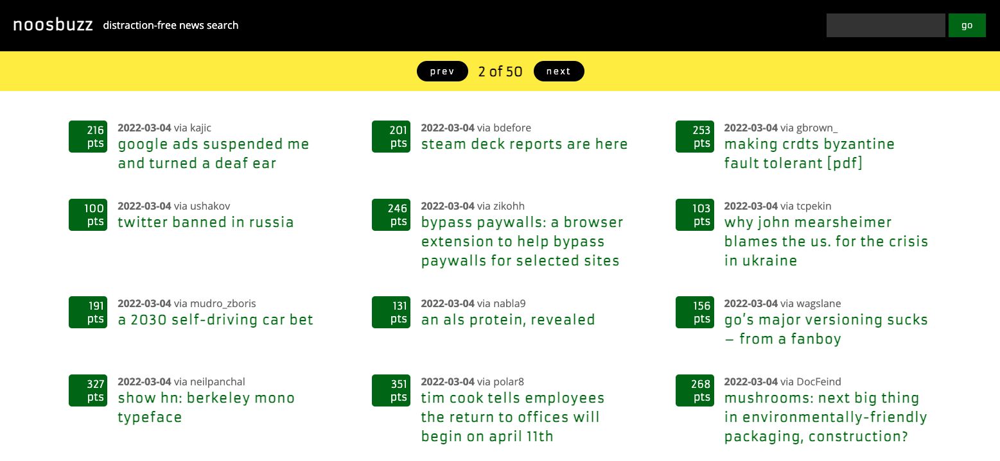

# 🗞 Noosbuzz

The site:&#x20;

* uses Algolia's wealthy [Hacker News](https://news.ycombinator.com/news) API&#x20;
* filters out any news story link under 100 points&#x20;
  * thus: list the most approved stories by Hacker News users
* paginates to avoid long pages
* lets the user search by keyword or see everything on load

### Demo



### Repo



### Future

* Include localStorage for keyword personalization&#x20;
* Include [Cosmic](https://www.cosmicjs.org) integration for further customizability
* Domain name&#x20;
*
