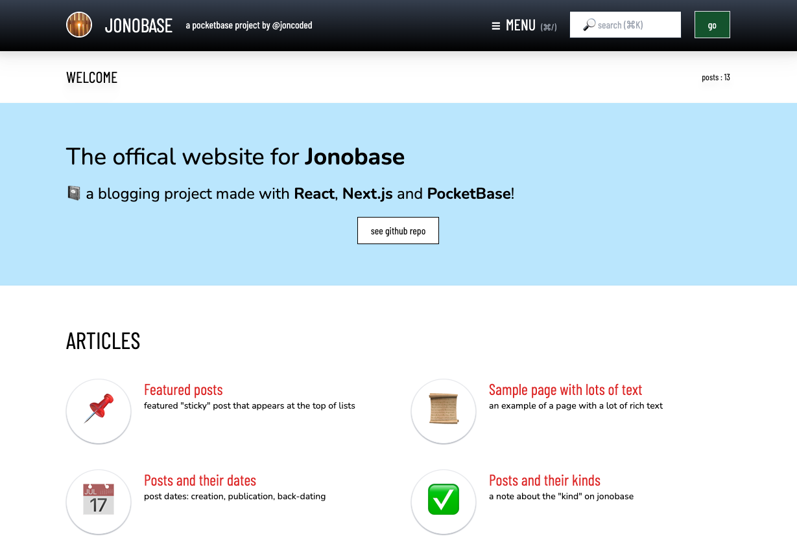

# 🛢 Jonobase

<figure><figcaption></figcaption></figure>


project demo



git repository


### Overview

* A personal experiment with a [**Pocketbase**](https://pocketbase.io) back-end and [**Next.js**](https://nextjs.org) front-end&#x20;
* "**Skip to main content**" link and "**dark mode**" for accessibility
* Home page includes customizable "views" with:&#x20;
  * **Rich text for welcome messages** at top
  * **Different post formats**, e.g.&#x20;
    * "cards" (image thumbnail links)
    * "drops" (emoji with post links)
    * "flats" (plain text links)
  * **Featured "sticky" posts** can list sticky posts before all others
* Post page includes:&#x20;
  * **hero (top image) banners**
  * **titles** and **summaries**
  * **rich text** and **syntax highlighting** (for code) in content
  * **previous/next post navigation** by post format _and_ by site
  * **lists** (**tags**) with separate tag pages
* Search page with:
  * **hot-key** (command + K) **search input**
* **Customizable menu, fat-footer and footer**
* **Pagination** (clickable and URL-based) on all list-type pages

### **Learnings**

* **React/Next.js** _app_ router (vs _pages_ router)
  * SEO-friendly URLs
* **Pocketbase** query language
* **PocketHost.io** back-end troubleshooting

### Pipeline

* Need to improve page load and querying performance

### Example pages

* Home: [https://jonobase.vercel.app/](https://jonobase.vercel.app/)
* Post: [https://jonobase.vercel.app/posts/featured-posts](https://jonobase.vercel.app/posts/featured-posts)&#x20;
* Post kind (with pagination): [https://jonobase.vercel.app/kinds/pages](https://jonobase.vercel.app/kinds/pages)
