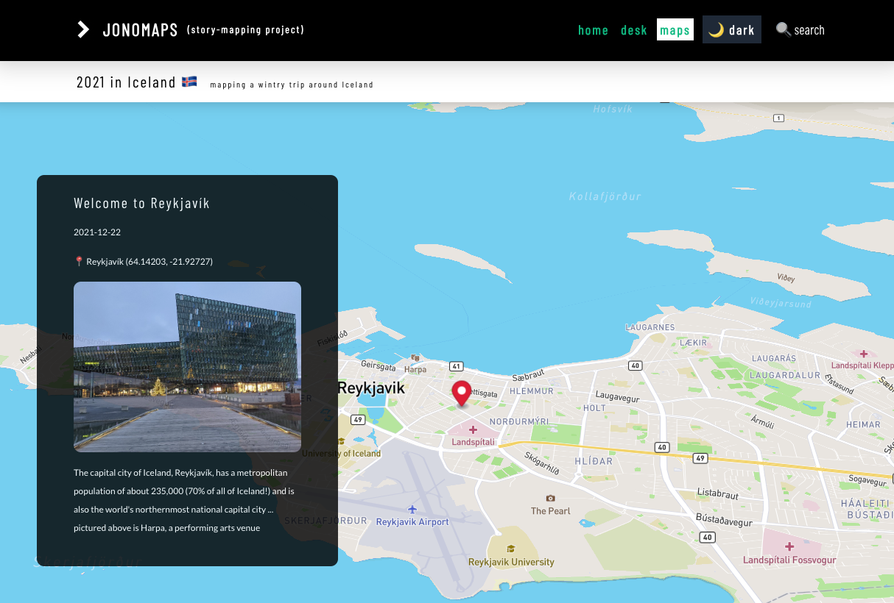

# 🗺 Jonomaps

<figure><figcaption></figcaption></figure>


project demo



git repository


### Overview

* A map storytelling framework with a [**Cosmic**](https://cosmicjs.com) back-end and [**React**](https://react.dev)/[**Tailwind**](https://www.tailwindcss.com)/[**Mapbox**](https://mapbox.com) front-end
* "**Skip to main content**" link and "**dark mode**" for accessibility
* Home page includes index of maps with search feature
* Post page includes:
  * A **scrollable full-screen map** with **waypoints**
* Sticky header and customizable footer (via the back-end)

### **Learnings**

* Front-end work with [**React**](https://react.dev) **+** [**Tailwind**](https://www.tailwindcss.com) **+** [**Mapbox**](https://mapbox.com)
* Testing the features (and limitations) of the [**Cosmic**](https://cosmicjs.com) back-end (on a _Free_ plan no less!)

### Pipeline

* Future iterations should have an easier installation process
* Utilize an easier back-end for geographical data entry (perhaps [**MongoDB**](https://mongodb.com)?)

### Example pages

* Home: [https://jonomaps.netlify.app](https://jonomaps.netlify.app)
* Post: [https://jonomaps.netlify.app/maps/2021-iceland](https://jonomaps.netlify.app/maps/2021-iceland)&#x20;

