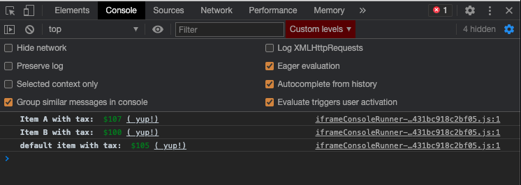

# JavaScript console styling

Earlier we looked at the [console](../javascript-setup/javascript-console.md) but now we can enhance our experience with it when we making logs to it, like this:



We can actually style how the messages appear in the `console.log` appear for increased readability:

```
console.log(`
    %c statement1 with style1: %c statement2 with style2`,
    'font-weight: bold',
    'color: red'
)

console.log(`
    %c statement1 with style1: 
    %c statement2 with style2
    (%c statement3 with style3)`,
    'font-weight: bold',
    'color: red',
    'text-decoration: underline'
)
```

Simply, we use:

* `%c` to begin a "block" of log text with CSS
* arguments (after the first argument) to write the CSS


If we have more `%c` than arguments after the first argument, then the extra `%c` will appear as plain text!


In general:

```
console.log(textLoggedWithPercentCs, [ cssBlocks ])
```
