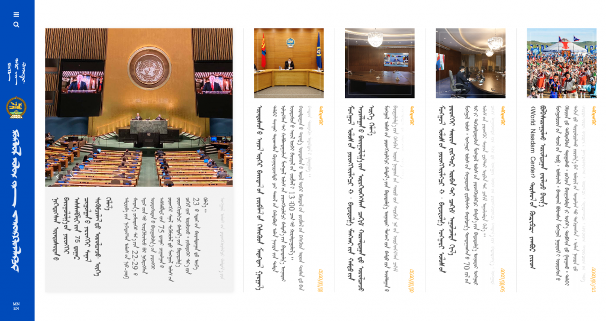

# President of Mongolia

### [president.mn/mng](https://president.mn/mng)

* a website produced in the traditional Mongolian \([Hudum Mongol bichig](https://en.wikipedia.org/wiki/Mongolian_script)\) script \(which writes from top to bottom\)
  * thus, the website necessitates _horizontal scrolling_
  * the layout is tilted 90 degrees counter-clockwise to a typical left-to-right \(LTR\) website
* strangely:
  * Mongolians in Mongolia use Cyrillic \(Russian\) script in everyday writing
  * ...while Mongolians in China use the Traditional script
  * the Mongolian script originates from Syriac, which in turn, came from Phoenician, which actually forms the ancestor of most alphabets including Greek and Latin \(English!\)

