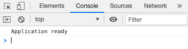

# JavaScript console

For debugging purposes, we can output any processed data without directly affecting the program using **console logging** or `console.log`:

```javascript
const aVariable = "Application ready"
// a piece of text 

console.log(aVariable) 
// outputs "Application ready" 
```

We can access the `console` by&#x20;

* loading the page that contains the script on the browser
* right-clicking on the page
* clicking on "Inspect" (or similar)
* finding the "Console" tab:&#x20;



Thus, we can see what happens to our code without directly displaying it on the browser!

### Another example

In `app.js` once again, we could use `console.log` as a calculator:

```javascript
const aVariable = 2 + 3
// an assignment to a variable

console.log(aVariable) 
// outputs 5
```

...checking a variable made of other variables:

```javascript
const firstNumber = 2     
// this could come from user input
const secondNumber = 3    
// this could come from an external file

const aVariable = firstNumber + secondNumber
// adding the above two together

console.log(aVariable) 
// outputs 5
```

Wwe can see how `console.log` enables us to see outputs of sensitive calculations without showing them directly on the webpage!
