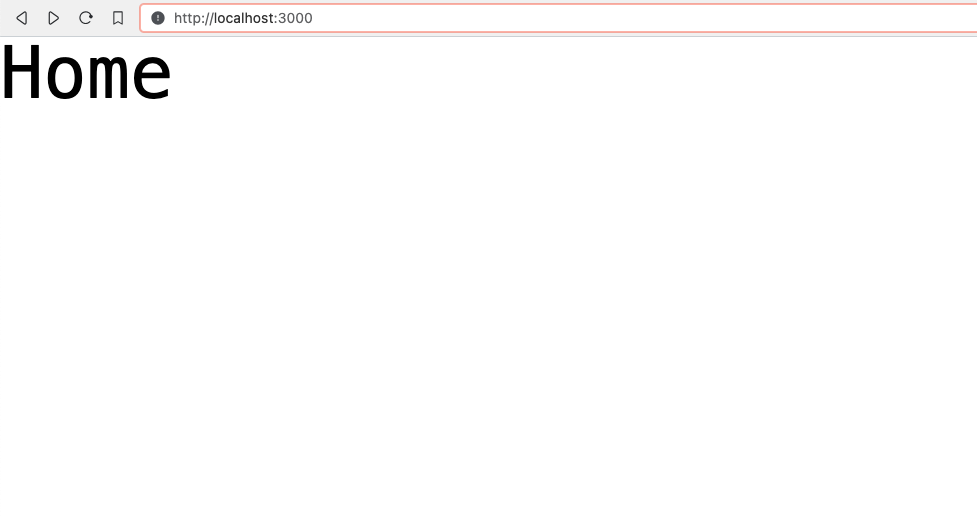

# 1⃣ Next.js first page

Now that we have the foundation setup for building our Next.js app, let's build our first page:&#x20;

### Homepage

* In the `app` folder, create a file called `page.tsx`&#x20;


```jsx
export default function Main() {
    return (
        <h1>Home</h1>
    )
}
```


* Alright, this gets as basic as it can get, now let's see it in action:

```bash
npm run dev
```

* This will open up `localhost:3000` on the browser
  * We should see a simple page with "Home"
  * Every saved change we make to `page.tsx` will immediately **hot reload** the browser

### Layout

* We will notice that Next.js also generates a file called `layout.tsx`
  * This file produces the **root** structure for our web app
  * We _cannot_ delete or rename `layout.tsx` but we can make changes to it
* At its barest, the root layout consists of `metadata` and the `RootLayout` function
  * The `metadata` comes with a `title` and `description` for SEO purposes
  * The `RootLayout` carries the high-level DOM: `html` and `body`
    * `{children}` , as we can guess, refers to the DOM in `page.tsx`


```jsx
export const metadata = {
  title: 'Next.js',
  description: 'Generated by Next.js',
}

export default function RootLayout({
  children,
}: {
  children: React.ReactNode
}) {
  return (
    <html lang="en">
      <body>{children}</body>
    </html>
  )
}
```


### Test the Tailwind styles (optional)

* Let's also test the Tailwind we added [previously](next.js-setup.md)
* In `layout.tsx` import the `global.css` file


```jsx
import "./global.css"

export const metadata = {
  title: 'jonovert',
  description: 'converting units of measurements',
}

export default function RootLayout({
  children,
}: {
  children: React.ReactNode
}) {
  return (
    <html lang="en">
      <body>{children}</body>
    </html>
  )
}
```


* Finally, in `app/page.tsx` let us test a few styles in the `<h1>` tag:&#x20;


```jsx
export default function Main() {
    return (
        <h1 className="font-mono text-5xl">Home</h1>
    )
}
```


* Have a look at `localhost:3000` and, as opposed to "**Home**" in the default serif font", something like this should appear:

<figure><figcaption></figcaption></figure>

