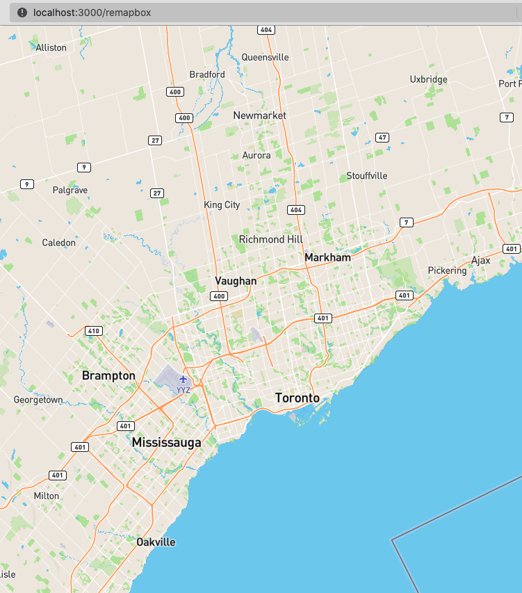

# 🗺 React with Mapbox

[Mapbox](https://www.mapbox.com) allows us to display a customized map on our own websites (provided we stay within limits) - to do so, we need:

### Prerequisites

* [Mapbox access token](https://account.mapbox.com)
* [Mapbox GL](https://docs.mapbox.com/mapbox-gl-js/api/) Javascript library
* Node.js with npm installed
* [GitHub](https://github.com) account (optional for deployment)
* Some React and JavaScript experience


Please ensure that only the desired website URL(s) may use your **Mapbox access token**!


### Setup

In your project folder:

* Use `npm init` to create a `package.json` file at the root
* Create a `public` folder for the final product and create the files:
  * `index.html` where the final product will display
  * `index.css` to house the styles for index.html
* Create an `src` folder and create the files to compile:
  * `index.js` for all the React logic

#### Setting up `package.json`

* Run the following commands in Terminal

```
% npm install mapbox-gl react react-dom react-scripts worker-loader
```

* Check if the `package.json` looks something like this:

```javascript
{
  "name": "(your project name)",
  "version": "1.0.0",
  "description": "React-based mapbox portfolio",
  "main": "index.js",
  "scripts": {
    "start": "react-scripts start",
    "build": "react-scripts build",
    "test": "react-scripts test",
    "eject": "react-scripts eject"
  },
  "keywords": [
    "mapbox",
    "react",
    "maps"
  ],
  "author": "(you)",
  "license": "ISC",
  "dependencies": {
    "mapbox-gl": "^2.7.0",
    "react": "^17.0.2",
    "react-dom": "^17.0.2",
    "react-scripts": "^2.1.3",
    "worker-loader": "^3.0.8"
  },
  "browserslist": [
    ">0.2%",
    "not dead",
    "not ie <= 11",
    "not op_mini all"
  ]
}

```

(Compare the "scripts" object to see if it matches)

### Creating the HTML index file

* We'll go into the `public` folder and open the `index.html` file
* The following lines will minimally setup our map interface:


```markup
<!DOCTYPE html>
<html lang="en">

  <head>

    <title>mapazine</title>
    
    <meta charset="utf-8" />
    <meta name="viewport" content="width=device-width, initial-scale=1" />

  </head>

  <body>
  
    <div id="app"></div>
  
  </body>

</html>

```


### Creating the React front-end logic

* We'll now go into our `src/index.js` file:


```jsx
import React from "react"
import ReactDOM from "react-dom"
import "mapbox-gl/dist/mapbox-gl.css"
import "./index.css"
import App from "./App"

ReactDOM.render(
  <React.StrictMode>
    <App />
  </React.StrictMode>,
  document.getElementById("app")
)
```


* Unpacking the above:
  * the first two lines deal with React
  * the third line deals with the Mapbox styling library
  * the line with `index.css` contains our own styling in the `src` folder
  * the line with `App` contains our App logic
  * finally, we have our app as the remainder of the file
    * all that React code will populate the `<div id="app"></div>` of the `index.html` file

### Initializing the MapBox API key

* Now that we have our React Mapbox workspace setup, we will move into the App.js file:&#x20;


```jsx
import React, { useRef, useEffect, useState } from "react"

import mapboxgl from "!mapbox-gl" // eslint-disable-line import/no-webpack-loader-syntax

function App() {
  mapboxgl.accessToken = process.env.REACT_APP_MAPBOX_KEY;
  return <div ref={mapContainer} className="map-container" />
}

export default App
```


* We must now create an `.env` file in the project's root folder:

```
REACT_APP_MAPBOX_KEY=(YOUR_API_KEY_HERE)
```

* React needs the `REACT_APP_` part of the variable name
  * To access that `.env` variable, we use `process.env.REACT_APP_` in our JS file


Ensure you have your own API key from [https://account.mapbox.com/access-tokens](https://account.mapbox.com/access-tokens)&#x20;


### Initializing the map defaults

* We still have to give our map its default values for&#x20;
  * geographical coordinates (latitude and longitude)
  * zoom level&#x20;
  * etc.
* We shall then kick-start our map, again in `src/App.js`:


```jsx
import React, { useRef, useEffect, useState } from "react"

import mapboxgl from "!mapbox-gl" // eslint-disable-line import/no-webpack-loader-syntax

function App() {
  mapboxgl.accessToken = process.env.REACT_APP_MAPBOX_KEY
  const mapContainer = useRef(null)
  const map = useRef(null)
  const [lng, setLng] = useState(-79.3832)
  const [lat, setLat] = useState(43.6532)
  const [zoom, setZoom] = useState(9)

  useEffect(() => {
    if (map.current) return // initialize map only once
    map.current = new mapboxgl.Map({
      container: mapContainer.current,
      style: "mapbox://styles/mapbox/streets-v11",
      center: [lng, lat],
      zoom: zoom
    })
  })

  return <div ref={mapContainer} className="map-container" />
}
export default App
```


* In the above, we implemented two things:
  * a `useEffect` hook that ensures the rendering happens anytime the state changes
  * a `return` statement that will provide a container for the map
    * recall the `useRef` hook at the top of the `Map` functional component

### Styling the map

* Lastly, we just need to add some CSS in `src/index.css`


```css
.map-container {
  position: absolute;
  top: 0; right: 0; left: 0; bottom: 0
}
```


### Running the map

* OK, let's test the map!
* Go back to Terminal into the project folder and type `$ npm start`
* When we see a message that says "Compiled successfully!" we can then:
  * take note of the addresses where we can view in the browser
  * go to the browser and have a look



### Deployment

* Please refer to [deployment](../web-operations/deploying-on-netlify.md) to see how to make this map appear on the Internet:

