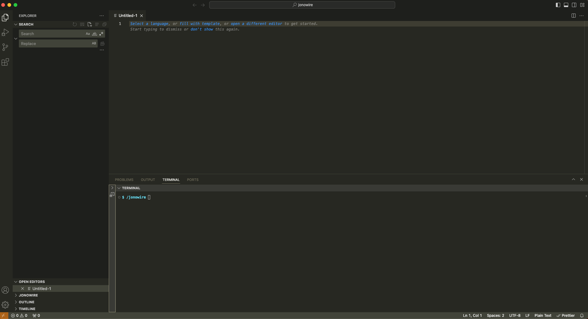

# 🧰 Workspace

### Setting up essential software

* **Code editor** (we only need this for now!)
  * [Visual Studio Code](https://code.visualstudio.com) (others exist but we will go with the most popular)

### Starting a new project

* Open VS Code&#x20;
* _File > New Window_

### Project folder setup

In the Welcome screen, let's create a project folder:

* Click on "Open..." and create a new folder anywhere

### Working on the project

We should now see something like this:

<figure><figcaption></figcaption></figure>

We can divide this interface into three main parts:

* Left "sidebar" (a bird's eye view of our project + dev enhancements)
  * _Search_: complex functionality for finding-and-replacing!
  * _Open editors_: what files we have open
  * _Timeline_: what steps we've taken
* "Code-editing space" (allows splitting to work on more than one file!)
* Bottom "command space"
  * _Terminal_: (we will explain below)


We can fully customize VS Code so that the sidebar can also appear on the right - VS Code has a lot of flexibility in the arrangement of "**panes**"!


#### Command-line view

In addition to using the Finder (or File Explorer), we can have a command-line (aka _Terminal_) interface, that will help us navigate through folders and files:

* On the top VS Code application bar, let's try _View_ > _Terminal_
* At the bottom of VS Code, a _Terminal_ panel will appear
* Here we can enter commands like `ls` to list the folders and files of our project

### Saving the workspace

We will continue working on the project later but let's save the "workspace":

* _File_ > _Save Workspace as..._
* Let's actually save this file outside of our project folder

When we open this workspace file later, it will tell VS Code what files to re-open!

### Other things to do

As we become comfortable with VS Code, we can also enhance our "developer experience" via:

* **Extensions** (optional language-specific helper plug-ins)
* **Configurations** (e.g. keyboard shortcuts)

For now, have fun coding and enjoy!
