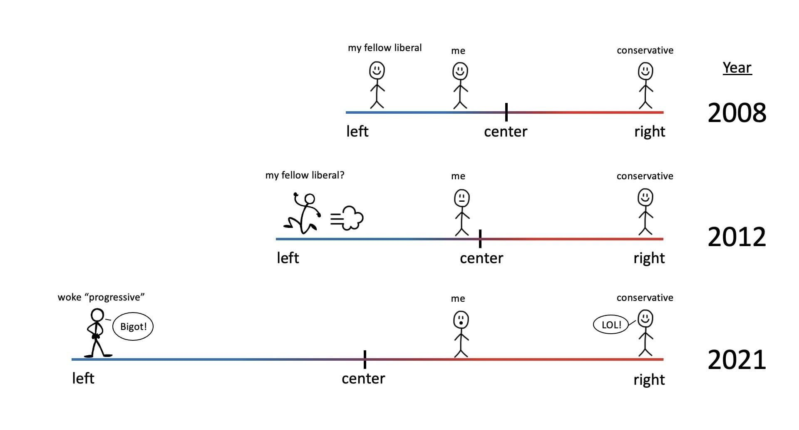

# 😎 The split society

Anyone should have noticed, since 2016 and especially since 2020, that by now:&#x20;

* You can no longer convince other people of things that go against their belief set
  * despite glaring evidence against them (with mountains of proof and evidence), the other side will simply resist or change the subject
  * this goes regardless of which "political" "side" you lie on; no one is as "open minded" as they think
* Essentially: people have made up their minds about things and will only change them _if they want to_ and not because someone else has a convincing argument

### Split society

Each "side" has become so hard-wired to hold onto their belief set:

* Say if a person, P, likes ideology X
  * &#x20;if you like X then you are "cool" with P
    * you and P like X because of A1, A2, A3 and so on
  * if you don't like ideology X then you are "not cool" with P
    * you might like ideology Y because of B1, B2, B3 and so on&#x20;
    * also Y would respectively oppose A1, A2, A3 and so on
    * if you like B1 (and so on) then you cannot like A1 (and its corresponding B's)
    * then you can never be "cool with P"
    * which results in a polarized relationship

Of course, there exist degrees of polarization:&#x20;

* a person who likes X can still try to remain friends with someone likes Y because
  * X and Y might like A1 and A2
  * but X likes A3 while Y likes B3
* so:&#x20;
  * the relationship invariably instigates a "micro cold war" between two people based on the A3-B3 split

### Infinitely split society

Inevitably, as well, for example:

* A person, P, may like A1, B2, B3, A4, A5
* Another person, Q, may like B1, B2, B3, A4, A5

Thus, while P and Q quarrel over A1 and B1 (but agree with everything else):

* P might go find someone, S, who likes A1 (but then A2, A3, A4, A5)
  * P might then wish to align their preferences towards all of S's interests
* Q might then go find someone, T, who likes B1 (but then B2, B3, B4, B5)
  * Q might then wish to align their preferences towards all of T's interests

Still, if P and Q are not perfectly impressionable people, they will not fully get along with S and T either; taking this _ad infinitum_, we would have a society that is split as many times as there are people, given that individual people also count as "interests"!

### Temporarily united?

It sounds scary or almost sad to think about such a society, yet I foresee that in the future:

* Each of us will try more so to interact with people only temporarily because of a common goal
* Each of us will not try to change the other person's views on other goals during that interaction (as changing one's mind is up to the individual)&#x20;
* Permanent unions (yes, those ones that you might be jokingly thinking about) will become less common&#x20;
  * As they are now, such unions will work for those who really think them through and not just for the sake of becoming a permanent union
* Individuals can then live in peace while joining others in harmony
  * only temporarily and for a common goal, if the relationship is weak
  * permanently, only if the relationship is very strong
